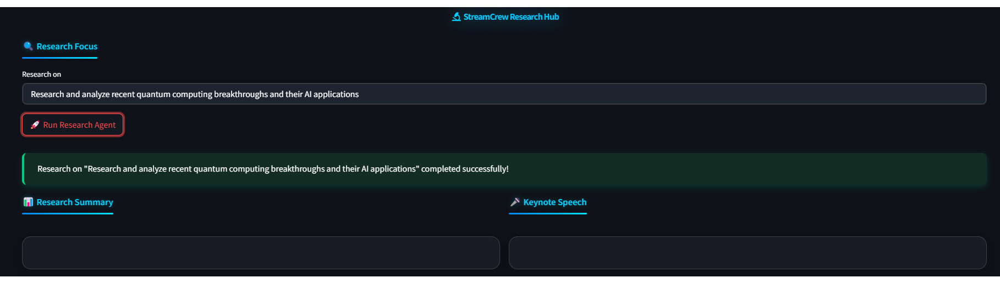

# KeynoteGenie 🔬

KeynoteGenie is an AI-powered research assistant that automatically researches any topic and prepares professional keynote speeches. Built with CrewAI and Streamlit, this application streamlines what would normally take hours of work into a single click.



## ✨ Features

- **Automated Research**: Scours the web for the latest information on your chosen topic
- **Keynote Speech Generation**: Transforms research findings into ready-to-deliver professional speeches
- **End-to-End Solution**: Handles the entire process from topic selection to final presentation
- **Topic Flexibility**: Research any subject - from technology to business, science to arts
- **Time-Saving**: Condenses hours of research and writing into minutes

## 🚀 Getting Started

### Prerequisites

- Python 3.8 or higher
- An API key from [Serper Dev](https://serper.dev/api-key) for web search capabilities

### Installation

1. Clone the repository:
   ```bash
   git clone https://github.com/yourusername/KeynoteGenie.git
   cd KeynoteGenie
   ```

2. Create and activate a virtual environment:
   ```bash
   python -m venv venv
   
   # On Windows
   .\venv\Scripts\activate
   
   # On macOS/Linux
   source venv/bin/activate
   ```

3. Install the package in development mode:
   ```bash
   pip install -e .
   ```

4. Create a `.env` file in the project root with your API keys:
   ```
   SERPER_API_KEY=your_serper_api_key_here
   ```

### Running the Application

Start the Streamlit interface:

```bash
cd src/ui
streamlit run app.py
```

Or alternatively:

```bash
python -m streamlit run src/ui/app.py
```

The application will be available at http://localhost:8501

## 📊 How It Works

KeynoteGenie uses a two-agent system powered by CrewAI:

1. **Research Agent**: Searches the internet for the latest information on your chosen topic using the SerperDevTool
2. **Writing Agent**: Transforms the research findings into a coherent, engaging keynote speech

The process is fully automated and provides detailed logging of each step, including the web search queries and results.

## 📁 Project Structure

```
KeynoteGenie/
├── src/                      # Source code
│   ├── agents/               # AI agent definitions
│   ├── config/               # Configuration files
│   ├── models/               # LLM integration
│   ├── ui/                   # Streamlit interface
│   └── utils/                # Utility functions
├── logs/                     # Application logs
├── outputs/                  # Generated research and speeches
├── .env                      # Environment variables (create this)
├── requirements.txt          # Project dependencies
└── setup.py                  # Package configuration
```

## 💻 Usage Examples

1. **Technology Research**:
   - Enter "Recent AI breakthroughs and their business applications" in the research field
   - Click "Run Research Agent"
   - Wait for the process to complete
   - Review the research summary and keynote speech

2. **Versatile Topics**:
   - The system can research virtually any topic you're interested in
   - Try researching emerging technologies, scientific advances, business trends, or cultural phenomena

## 🛠️ Development

To contribute to KeynoteGenie:

1. Fork the repository
2. Create a feature branch: `git checkout -b feature/amazing-feature`
3. Commit your changes: `git commit -m 'Add amazing feature'`
4. Push to the branch: `git push origin feature/amazing-feature`
5. Open a Pull Request

## 📄 License

This project is licensed under the MIT License - see the LICENSE file for details.

## 👥 Contributors

- KeynoteGenie Team

## 🔗 References

- [CrewAI](https://docs.crewai.com/) - Framework for orchestrating role-playing, autonomous AI agents
- [Streamlit](https://streamlit.io/) - The fastest way to build data apps
- [Serper Dev](https://serper.dev/) - Google Search API for web research

---

Built with ❤️ using Python, CrewAI, and Streamlit
